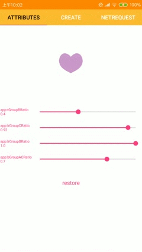
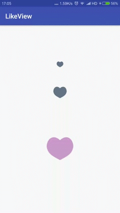

 # LikeView

[](https://www.android.com)
[](https://android-arsenal.com/api?level=14)
[ ](https://bintray.com/qkxyjren/maven/likeview/_latestVersion)




## How to use

### 1、To include likeview to your project:

add the dependency to the the  build.gradle file

```gradle
    compile 'com.jaren:likeview:1.2.2'
```
### 2、Create likeview :

#### create default
  ```xml
      <com.jaren.lib.view.LikeView
        android:id="@+id/lv"
        android:layout_width="wrap_content"
        android:layout_height="wrap_content"
        app:cirRadius="10dp"
        app:cycleTime="2000"
        app:defaultColor="#ff657487" />
``` 
#### create with image icon
```xml
       <com.jaren.lib.view.LikeView
         android:id="@+id/lv_icon"
         android:layout_width="wrap_content"
         android:layout_height="wrap_content"
         android:layout_gravity="center_horizontal"
         app:ringColor="#ff44ff00"
         app:checkedColor="#ff44ff00"
         app:defaultColor="#ffcccccc"
         app:checkedLikeIconRes="@mipmap/btn_checked"
         app:defaultLikeIconRes="@mipmap/btn_check_default"
         app:cirRadius="14dp"
         app:cycleTime="2000"/>
```
#### created by `LikeViewBuilder`
```java
        final LikeView likeView=new LikeViewBuilder(getContext())
            .setRadius(getResources().getDimension(R.dimen.lv_radius))
            .setDefaultColor(Color.GRAY)
            .setCheckedColor(Color.RED)
            .setCycleTime(1600)
            .setUnSelectCycleTime(200)
            .setTGroupBRatio(0.37f)
            .setBGroupACRatio(0.54f)
            .setDotColors(DOT_COLORS)
            .setLrGroupBRatio(1)
            .setInnerShapeScale(3)
            .setDotSizeScale(10)
            .setAllowRandomDotColor(false)
            .create();

```

### 3、Change state
#### Add OnClickListener :

  ```java

        lv = (LikeView) findViewById(R.id.lv);
        lv.setOnClickListener(new View.OnClickListener() {
                       @Override
                       public void onClick(View v) {
                           lv.toggle();
                       }
                   });
```
#### Change the checked state :

  ```java

        //Change the checked state of the view
        lv.setChecked(true);
        lv.setCheckedWithoutAnimator(true);

        //Change the checked state of the view to the inverse of its current state
        lv.toggle();
        lv.toggleWithoutAnimator();
```
## LikeView has the following xml attributes

You can customize the look and behavior of the `LikeView` in xml. Use the following attributes in xml.

| attribute | description |
| --------------- | --------------------- |
|defaultColor|the default color for the heart shape|
|checkedColor|the checked color for the heart shape|
|ringColor|the ring color|
|cirRadius|the only attributes that can determine the LikeView size|
|cycleTime|select animation-duration(ms)|
|unSelectCycleTime|the unselect animation-duration(ms)|
|defaultLikeIconRes|the default icon,using icon instead of heart shape|
|checkedLikeIconRes|the checked icon,using icon instead of heart shape|
|lrGroupCRatio|sets controller point ratio to change left and right of the bottom part of heart shape view|
|lrGroupBRatio|sets controller point ratio to change left and right of the center of heart shape view|
|bGroupACRatio|sets controller point ratio to change the bottom of heart shape view|
|tGroupBRatio|sets controller point ratio to change the top of heart shape view|
|innerShapeScale|the inner shape size , there is  positive correlation between  inner shape size and `innerShapeScale`.value range in [2,10] is suggested.|
|dotSizeScale|the dot size , there is  negative correlation between dot size and `dotSizeScale`.value range in [7,14] is suggested. |
|allowRandomDotColor|whether random dot color is allowed,default is true|


## Example

[Download APK](resource/likeview_release.apk)   

[Examples](https://github.com/qkxyjren/LikeView/tree/master/app/src/main/java/com/jaren/likeview)

## Change log
### 1.2.2
- fix state `onDetachedFromWindow`

### 1.2.1
- fix icon state

### 1.2.0
- add attribute to adjust the heart shape view
- support using icon instead of heart shape

### 1.1.0
- no longer change checked state within the LikeView itself
- add `setCheckedWithoutAnimator(boolean checked)`
- add `toggleWithoutAnimator()`

### 1.0.0

License
----------

    Copyright 2017~2018 jaren

    Licensed under the Apache License, Version 2.0 (the "License");
    you may not use this file except in compliance with the License.
    You may obtain a copy of the License at

       http://www.apache.org/licenses/LICENSE-2.0

    Unless required by applicable law or agreed to in writing, software
    distributed under the License is distributed on an "AS IS" BASIS,
    WITHOUT WARRANTIES OR CONDITIONS OF ANY KIND, either express or implied.
    See the License for the specific language governing permissions and
    limitations under the License.